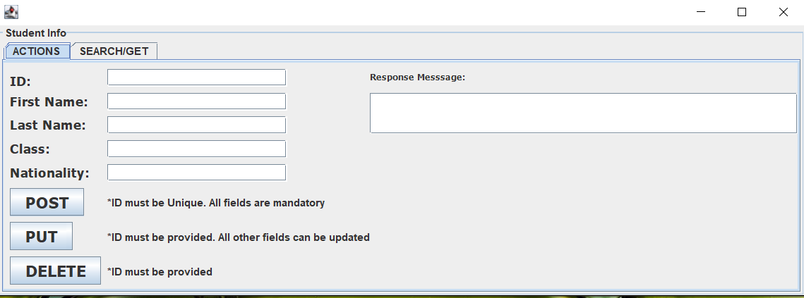
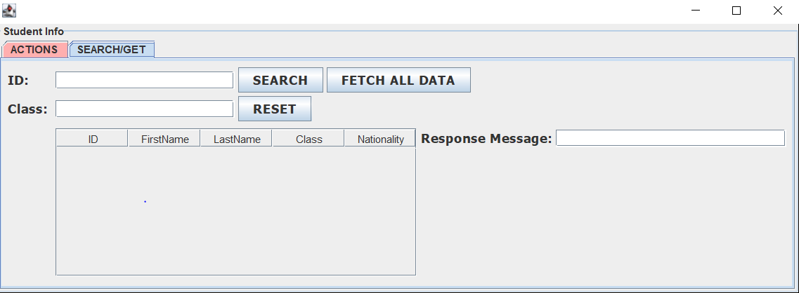
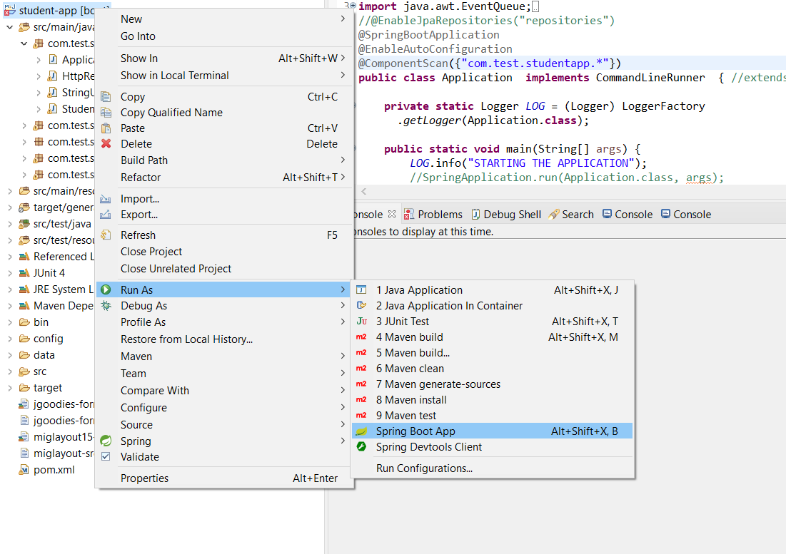
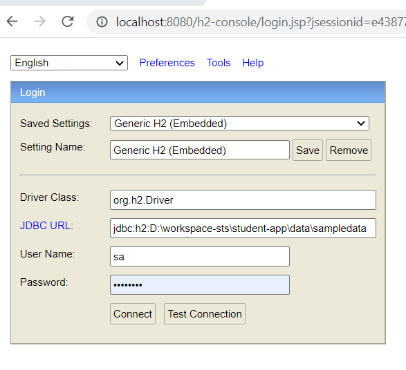
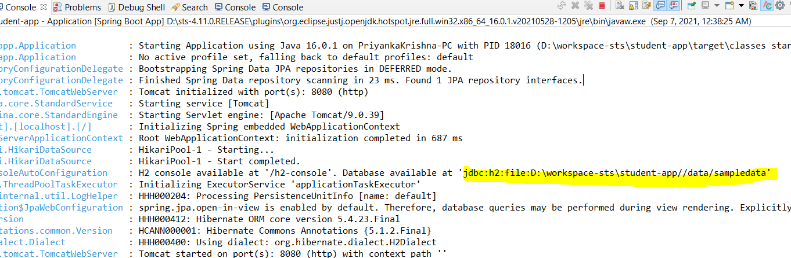
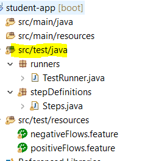

<!-- TABLE OF CONTENTS -->

  
Table of Contents

  <ol>
    <li>
      <a href="#about-the-project">About The Project</a>
      <ul>
        <li><a href="#built-with">Built With</a></li>
      </ul>
    </li>
    <li>
      <a href="#getting-started">Getting Started</a>
      <ul>
        <li><a href="#prerequisites">Prerequisites</a></li>
       </ul>
    </li>
    <li><a href="#usage">Usage</a></li>
    <li><a href="#contact">Contact</a></li>
    
  </ol>

<!-- ABOUT THE PROJECT -->
## About The Project
This is a simple light-weight Student Info application built using Java language.
All the CRUD operations are supported.

![Student's App Main Screen]

![Student's App Search Screen]

### Built With
* [Spring Boot Framework](https://spring.io/projects/spring-framework)
* [Apache h2 database](https://www.h2database.com/)
* [REST API](https://www.mulesoft.com/resources/api)
* [Mockito for Unit Testing](https://site.mockito.org/)
* [Cucumber BDD for testing](https://cucumber.io/) REST Assured lib

<!-- GETTING STARTED -->
## Getting Started

Download the entire repository and import in Eclipse or Spring tool suite(STS).
When importing the project, select Maven > Maven Existing project option.

### Prerequisites
Following addin must be installed in your Eclipse.
* Maven
* WindowsBuilder (Swing GUI- to view the design) NOT MANDATORY
* Apache Tomcat service running to be stopped. Press Windows+R, type "Services.msc". Stop Apache Tomcat service if is already running. This is because apache h2 console requires service to be started. However if you dont want to check data in h2 database console then you can make changes in config/application.properties for the console to be disabled.
  **spring.h2.console.enabled=false**

## Usage
After importing the project, Run as Spring Boot app and select Application.java as main class.

![Run configuration]

Moreover, if importing and running is not possible then Executable-jar is also uploaded to main folder.
Download it and double-click on it. All the api's and the database too will be up and running.
Name: student-app.jar

### To access Database
 Open http://localhost:8080/h2-console/login.jsp in browser.
 [user: sa, password: password]
 JDBC URL: jdbc:h2---Path to sampledata--basedir/data/sampledata.mv.db
 The path is also updated in the Eclipse console logs.
 ![h2 console browser]
 ![Eclipse Console]
 
 Also note that when application is brought up, the database table schema and sample data provided under (src/main/resources) folder are executed.
 
### Postman 
Postman can be used to test the API's manually. 
The workspace is exported and uploaded to base directory of this repository (postman\StudentApp.postman_collection.json)
You can import this in Postman and run the tests once application is started. 

### Cucumber BDD for Testing
I have used BDD framework to run the tests to check API's functionality (src/test/java)
![Cucumber folder structure]

There are 2 feature files. One with the happy flow and the other one with invalid data to check the API response.

